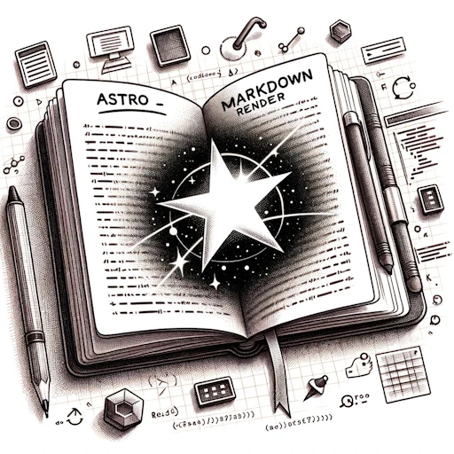
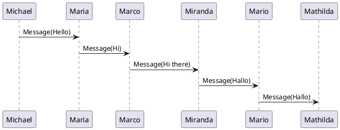
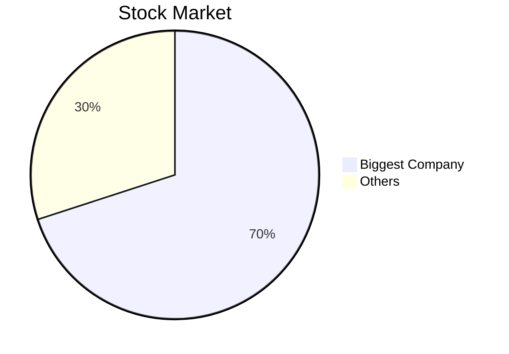

# Simple examples
this page illustrates all use cases supported in this project.

Note, all headings get anchors and generate links

## code block
The code block offers a `copy` button visible on hover over the code.
```js
const count = 0
console.log(count)
```

## Image
Images are encapsulated inside a component that can open them in a Modal full view.



## SVG Image


## Table
Tables can get a custom style or be passed to custom tables components

| Column 1 | Column 2 |
|----------|----------|
| Row 1    | Row 1 c2    |
| Row 2    | Row 2 c2   |

## Links
* external link Astro Markdown Render [github repo](https://github.com/MicroWebStacks/astro-markdown-render) link is external and opens in a new page.

* Link to the [Image](/image) entry opens in the same page

# Code from diagrams
This is a concept where diagrams are generated from a code block that witholds the description needed to generate them. Note these sorts of diagrams are much more informative for automation and LLMs processing than usual bitmaps or vectorial images.

## Plantuml
This is a [plantuml](https://plantuml.com/sequence-diagram) sequence diagram



## mermaid
This is a [mermaid](https://mermaid.js.org/intro/) pie chart diagram



## Kroki
this is a [kroki](https://kroki.io/#examples) Block diagram

```blockdiag
blockdiag {
  Kroki -> is -> Awesome;
}
```


# 3D Model viewer
## with a link
just by inserting a link to a .glb file

```
[Turtle Flower](./trtl_flower.glb)
```
will generate this 3D [Model Viewer](https://modelviewer.dev/)

[Turtle Flower](./trtl_flower.glb)

