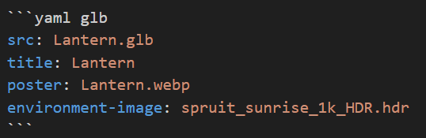

this page illustrates all use cases supported in this project.

Note, all headings get anchors and generate links

# Code block

The code block offers a `copy` button visible on hover over the code.

javascript
```js
const count = 0
console.log(count)
```
python
```python
for item in my_list:
  print(item)
```

# Images
## Simple Image link
Images are encapsulated inside a component that can open them in a Modal full view for Pan and zoom function and optimize them b e.g. generating webp from png

```markdown

```

will generate this image


## Advanced Image Directive
In order to give more options to the optimizer, using the image directive allows to pass more arguments from markdown

```markdown
:image[]{src=./astro-markdown-render-small.png alt="Astro Markdown Render" height=200}
```

will generate this image height adjusted image with respect to the aspect ratio

:image[]{src=./astro-markdown-render-small.png alt="Astro Markdown Render" height=200}

## SVG Image


# Links
* external link Astro Markdown Render [github repo](https://github.com/MicroWebStacks/astro-markdown-render) link is external and opens in a new page.

* Link to the [Image](/image) entry opens in the same page

# Tables
## Markdown Simple Table

A markdown table like this one

```markdown
| Column 1 | Column 2 |
|----------|----------|
| Row 1    | Row 1 c2 |
| Row 2    | Row 2 c2 |
```

is a table that has a low number of lines and therfore gets a simple table view

| Column 1 | Column 2 |
|----------|----------|
| Row 1    | Row 1 c2 |
| Row 2    | Row 2 c2 |

## Markdown Data Table
A table with a high number of lines gets a [data-table](https://datatables.net/) element with filter and pagination

| Name   | Age | City         |
|--------|-----|--------------|
| Johnny | 36  | New York     |
| John   | 30  | New York     |
| Jane   | 28  | Los Angeles  |
| Janny  | 22  | Los Angeles  |
| Marc   | 28  | Los Angeles  |
| Marco  | 21  | Bahamas      |
| Joanna | 29  | New York     |
| Joanna | 29  | Los Angeles  |
| Alice  | 32  | Miami        |
| Bob    | 27  | Seattle      |
| Clara  | 33  | Chicago      |
| Dave   | 24  | Houston      |
| Ella   | 26  | Atlanta      |


## XLSX Table
It is also possible to create tables in xlsx format. This link of `.xlsx` extension

```markdown
[Table1](./Table1.xlsx)
```
will generate this table

[Table1](./Table1.xlsx)

# Diagrams from code
This is a concept where diagrams are generated from a code block that witholds the description needed to generate them. Note these sorts of diagrams are much more informative for automation and LLMs processing than usual bitmaps or vectorial images.

## Plantuml
This is a [plantuml](https://plantuml.com/sequence-diagram) sequence diagram


## mermaid
This is a [mermaid](https://mermaid.js.org/intro/) pie chart diagram


## Kroki
this is a [kroki](https://kroki.io/#examples) Block diagram

```blockdiag
blockdiag {
  Kroki -> is -> Awesome;
}
```


# 3D Model viewer
[Model Viewer](https://modelviewer.dev/) Makrdown plugin

models from https://modelviewer.dev/editor/

## From a link
just by inserting a link to a .glb file

```markdown
[Astronaut](./Astronaut.glb)
```
will generate this 3D model

[Astronaut](./Astronaut.glb)


## From code
This piece of code using as code language `yaml` and code meta-data : `glb` as follows




will generate this 3D model with the provided files.
* poster : allows fast page load, by loading the image only first.
* environment-image : for lighting effect

```yaml glb
src: Lantern.glb
title: Lantern
poster: Lantern.webp
environment-image: spruit_sunrise_1k_HDR.hdr
```
# References

this is how you can reference a page

```markdown
Link to page::svg-image
```
will produce this

Link to page::svg-image

Example for deep folder page, the slug is enough to link the full url

Link to page::image-svg-2

Note the url is defined as `folder.image-svg-2` but could also be `folder/image-svg-2`

