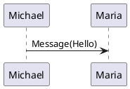
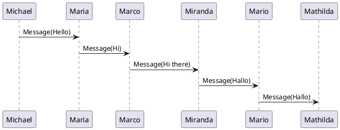

# Remark Plantuml Astro Component
This code is using `plantuml` as language for the code block.

```plantuml my-puml meta2 meta3
@startuml
Michael -> Maria : Message(Hello)
@enduml
```

# Large sequence example

```plantuml my-puml-2
@startuml
Michael -> Maria : Message(Hello)
Maria -> Marco : Message(Hi)
Marco -> Miranda : Message(Hi there)
Miranda -> Mario : Message(Hallo)
Mario -> Mathilda: Message(Hallo)
@enduml
```
